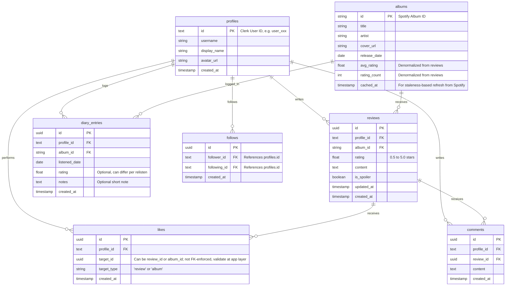

# Album Logging & Review Platform (Letterboxd for Music) - Project Plan

This document outlines the architecture, database design, and step-by-step roadmap for building the album-logging platform.

## Architecture & Tech Decisions (Finalized via Interview)

*   **Framework**: Next.js (App Router) + TypeScript.
*   **Styling**: TailwindCSS + **shadcn/ui** for UI primitives.
*   **Database**: Supabase (PostgreSQL) using `@supabase/ssr`.
*   **Authentication**: Clerk for Next.js.
*   **User Syncing**: Clerk Webhooks (`/api/webhooks/clerk`) to sync Clerk users directly to the Supabase `profiles` table.
*   **External API**: Spotify API for search, metadata, and high-quality artwork.
*   **Metadata Caching**: **Cache-on-write** (store Spotify album data in the Supabase `albums` table only when a user creates a review, rating, or list item), for **performance** rather than as permanent storage — refreshed opportunistically (re-fetch from Spotify if a cached row is older than N days) to stay closer to Spotify's "temporary caching" ToS language.
*   **Known risk**: Spotify's Feb 2026 API changes restrict Development Mode (Premium-gated test users, reduced search pagination, Client Credentials being phased out for metadata endpoints). MVP proceeds under Development Mode; revisit Extended Quota Mode application once the app has real usage.
*   **Navigation**: Twitter/X-style sidebar navigation (logo, nav links, user profile) with the main content area to the right.
*   **Responsive Strategy**: Desktop-first for the MVP. Mobile responsiveness is a post-MVP goal.

---

## Proposed Database Schema (Supabase / Postgres)

To support Letterboxd-like features (reviews, diary/relogging, likes, and follows), we'll define the following relational structure:

**Constraints beyond the ERD:**
- `reviews`: unique on `(profile_id, album_id)` — one canonical, editable review per user per album. `diary_entries` has no such constraint, so relistens/relogs are unlimited.
- `follows`: unique on `(follower_id, following_id)`; check constraint `follower_id <> following_id`.
- `likes.target_id`/`target_type` is a polymorphic reference, not FK-enforced — validated at the application layer.

---

## Phase-by-Phase Roadmap

> [!IMPORTANT]
> **MVP scope**: Phases 1–4. **Post-MVP**: Phase 5 (mobile responsiveness, notifications).

### Phase 1: Setup & Infrastructure *(MVP)*
1. Initialize a Next.js application using `create-next-app` with TypeScript, TailwindCSS, and ESLint.
2. Initialize `shadcn/ui` in the project.
3. Create a `.env.example` file documenting all required environment variables (`NEXT_PUBLIC_SUPABASE_URL`, `SUPABASE_SERVICE_ROLE_KEY`, `NEXT_PUBLIC_CLERK_PUBLISHABLE_KEY`, `CLERK_SECRET_KEY`, `CLERK_WEBHOOK_SECRET`, `SPOTIFY_CLIENT_ID`, `SPOTIFY_CLIENT_SECRET`).
4. Configure **Supabase** schemas and create migration scripts for all tables (`profiles`, `albums`, `reviews`, `diary_entries`, `likes`, `follows`, `comments`).
5. **Configure Supabase Row Level Security (RLS)** policies using the native Clerk Third-Party Auth integration (not the deprecated JWT template): public read access for albums and reviews; write/update/delete restricted to the owning user for reviews, diary_entries, likes, comments, and profile. Policies reference `auth.jwt() ->> 'sub'` for the Clerk user ID rather than `auth.uid()`, since Clerk IDs are strings, not Supabase UUIDs.
6. Integrate `@clerk/nextjs` for user auth.
7. Set up the Next.js Route Handler `/api/webhooks/clerk` to receive Clerk webhooks for `user.created` (create profile), `user.updated` (sync username/avatar changes), and `user.deleted` (remove/deactivate profile).
8. **Build the app shell layout**: Twitter/X-style sidebar (logo, Home, Search, Activity, Profile links, auth controls) with a main content area.
9. Configure `next.config.js` `images.remotePatterns` to allow Spotify's cover art CDN domain (`i.scdn.co`).
10. **Set up Vitest and React Testing Library** with `jsdom` for client-side and unit testing.
11. **Configure CI/CD**: Create a GitHub Actions workflow (`.github/workflows/ci.yml`) to automatically run linting (`next lint`), run tests (`vitest run`), and verify builds (`next build`) on every push and pull request. Set up Vercel integration for CD.

### Phase 2: Metadata Integration (Spotify) *(MVP)*
> Known risk: Development Mode restricts test accounts to Premium members and limits search pagination; Client Credentials is being phased out for some metadata endpoints. Proceed under Development Mode for MVP (see Architecture section).

1. Build a Next.js service/action that queries the Spotify Client Credentials flow to search for albums, retrieve album details, and get high-quality cover art.
2. Set up the cache-on-write hook to save albums to our DB when logged, storing a `cached_at` timestamp; refresh from Spotify if the cached row is stale on read.
3. Add unit tests with Vitest to mock and verify Spotify API querying logic.

### Phase 3: Core Features (Logging & Reviewing) *(MVP)*
1. **Landing Page**: Create a visually stunning landing page with a hero section, popular/trending albums showcase, reviews activity ticker, and compelling CTAs to prompt user signup.
2. **Global Search Bar + Search Results Page**: Add a search bar in the sidebar that queries the Spotify API, with a dedicated `/search` results page. This search is also reused in the logging flow to select the exact album.
3. **Album Page**: Show album details, overall community rating average (from `albums.avg_rating`/`rating_count`), and recent reviews.
4. **Logging Modal**: Allow users to rate (0.5 to 5 stars), specify if it's a spoiler, and select a "listened date". Always writes a `diary_entries` row on log; optionally upserts the canonical `reviews` row (unique per user/album) when the user is writing "their review" for the album, distinct from just logging a relisten.
5. **User Profile**: Show user's recent activity, diary/history (reads from `diary_entries`), top albums, and reviews (reads from `reviews`).
6. **Global user search**: search bar supports a "People" mode alongside album search, so users can discover people to follow ahead of Phase 4.
7. Add component tests using React Testing Library to verify rating state changes and form submission in the Logging Modal.

### Phase 4: Social & Discovery *(MVP)*
1. **Activity Feed**: Show reviews and logs from followed users (powered by the `follows` table).
2. **Follow System**: Allow users to follow/unfollow other users from their profile page.
3. **Likes & Comments**: Allow users to like reviews/albums and comment on reviews.

### Phase 5: Post-MVP Enhancements
1. **Mobile Responsiveness**: Adapt the sidebar to a bottom nav or hamburger menu for mobile viewports.
2. **Notifications**: Notify users when they receive new followers, likes, or comments.
3. **Spotify scale-up**: revisit applying for Extended Quota Mode once usage grows past Development Mode limits; consider MusicBrainz/Cover Art Archive as a supplemental or fallback metadata source if Spotify access becomes a hard blocker.
4. **Trending algorithm**: define and implement the "trending/popular albums" mechanism referenced on the landing page (e.g., a rolling window of review/like counts).

---

## Verification Plan

### Automated Tests
- Run `npm run test` (Vitest) to verify unit and component tests.
- Run `npm run build` to verify production Next.js compilation.
- Ensure the GitHub Actions pipeline runs successfully.
- Introduce Playwright for at least one E2E smoke test (sign up via Clerk → search album → log/review it) before considering Phase 4 complete, since the Clerk + Supabase + Spotify integration is hard to unit-test in isolation.

### Manual Verification
- Verify successful Clerk authentication redirection and Supabase user syncing, including profile updates/deletion via the expanded webhook.
- Test album search auto-completion using Spotify API keys.
- Check database constraints for duplicate reviews (unique `(profile_id, album_id)` upserts rather than duplicates), self-following prevention, duplicate follows, and rating limits.
- Verify `diary_entries` allows multiple relistens/relogs of the same album by the same user.
