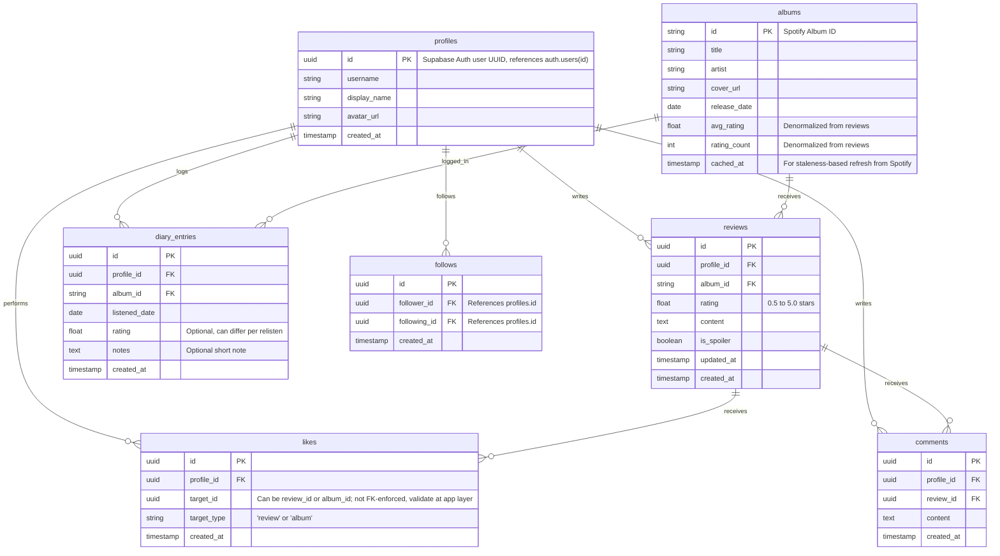

# Album Logging & Review Platform (Letterboxd for Music) - Project Plan

This document outlines the architecture, database design, and step-by-step roadmap for building the album-logging platform.

## Architecture & Tech Decisions (Finalized via Interview)

*   **Framework**: Next.js (App Router) + TypeScript.
*   **Styling**: TailwindCSS + **shadcn/ui** for UI primitives.
*   **Database**: Supabase (PostgreSQL) using `@supabase/ssr`.
*   **Authentication**: Supabase Auth (email/password + Google OAuth) via `@supabase/ssr`.
*   **User Syncing**: Postgres trigger on `auth.users` auto-creates a `profiles` row on signup. Username is set during an onboarding step at `/onboarding`.
*   **External API**: Spotify API for search, metadata, and high-quality artwork.
*   **Metadata Caching**: **Cache-on-write** (store Spotify album data in the Supabase `albums` table only when a user creates a review, rating, or list item), for **performance** rather than as permanent storage — refreshed opportunistically (re-fetch from Spotify if a cached row is older than N days) to stay closer to Spotify's "temporary caching" ToS language.
*   **Known risk**: Spotify's Feb 2026 API changes restrict Development Mode (Premium-gated test users, reduced search pagination, Client Credentials being phased out for metadata endpoints). MVP proceeds under Development Mode; revisit Extended Quota Mode application once the app has real usage.
*   **Navigation**: Twitter/X-style sidebar navigation (logo, nav links, user profile) with the main content area to the right.
*   **Responsive Strategy**: Desktop-first for the MVP. Mobile responsiveness is a post-MVP goal.

---

## Proposed Database Schema (Supabase / Postgres)

To support Letterboxd-like features (reviews, diary/relogging, likes, and follows), we'll define the following relational structure:

**Constraints beyond the ERD:**
- `reviews`: unique on `(profile_id, album_id)` — one canonical, editable review per user per album. `diary_entries` has no such constraint, so relistens/relogs are unlimited.
- `follows`: unique on `(follower_id, following_id)`; check constraint `follower_id <> following_id`.
- `likes.target_id`/`target_type` is a polymorphic reference, not FK-enforced — validated at the application layer.

---

## Phase-by-Phase Roadmap

> [!IMPORTANT]
> **MVP scope**: Phases 1–4. **Post-MVP**: Phase 4.5 (feed & engagement enhancements), Phase 5 (mobile responsiveness, notifications).

### Phase 1: Setup & Infrastructure *(MVP)*
1. Initialize a Next.js application using `create-next-app` with TypeScript, TailwindCSS, and ESLint.
2. Initialize `shadcn/ui` in the project.
3. Create a `.env.example` file documenting all required environment variables (`NEXT_PUBLIC_SUPABASE_URL`, `NEXT_PUBLIC_SUPABASE_ANON_KEY`, `SUPABASE_SERVICE_ROLE_KEY`, `SPOTIFY_CLIENT_ID`, `SPOTIFY_CLIENT_SECRET`).
4. Configure **Supabase** schemas and create migration scripts for all tables (`profiles`, `albums`, `reviews`, `diary_entries`, `likes`, `follows`, `comments`).
5. **Configure Supabase Row Level Security (RLS)** policies using `auth.uid()`: public read access for albums and reviews; write/update/delete restricted to the owning user for reviews, diary_entries, likes, comments, and profile.
6. Integrate `@supabase/ssr` for cookie-based session management in Next.js (server components, middleware, and client components).
7. Create a Postgres trigger on `auth.users` that auto-creates a `profiles` row on signup.
8. Build a custom login page at `/login` with sign-in/sign-up tabs and Google OAuth. Create auth callback routes (`/auth/callback`, `/auth/confirm`) for OAuth and email verification.
9. **Build an onboarding page** at `/onboarding` that prompts new users to choose a unique username after their first login. The middleware redirects authenticated users without a username to this page.
10. **Build the app shell layout**: Twitter/X-style sidebar (logo, Home, Search, Activity, Profile links, auth controls) with a main content area.
11. Configure `next.config.js` `images.remotePatterns` to allow Spotify's cover art CDN domain (`i.scdn.co`).
12. **Set up Vitest and React Testing Library** with `jsdom` for client-side and unit testing.
13. **Configure CI/CD**: Create a GitHub Actions workflow (`.github/workflows/ci.yml`) to automatically run linting (`next lint`), run tests (`vitest run`), and verify builds (`next build`) on every push and pull request. Set up Vercel integration for CD.

### Phase 2: Metadata Integration (Spotify) *(MVP)*
> Known risk: Development Mode restricts test accounts to Premium members and limits search pagination; Client Credentials is being phased out for some metadata endpoints. Proceed under Development Mode for MVP (see Architecture section).

1. Build a Next.js service/action that queries the Spotify Client Credentials flow to search for albums, retrieve album details, and get high-quality cover art.
2. Set up the cache-on-write hook to save albums to our DB when logged, storing a `cached_at` timestamp; refresh from Spotify if the cached row is stale on read.
3. Add unit tests with Vitest to mock and verify Spotify API querying logic.

### Phase 3: Core Features (Logging & Reviewing) *(MVP)*
1. **Landing Page**: Create a visually stunning landing page with a hero section, popular/trending albums showcase, reviews activity ticker, and compelling CTAs to prompt user signup.
2. **Global Search Bar + Search Results Page**: Add a search bar in the sidebar that queries the Spotify API, with a dedicated `/search` results page. This search is also reused in the logging flow to select the exact album.
3. **Album Page**: Show album details, overall community rating average (from `albums.avg_rating`/`rating_count`), and recent reviews.
4. **Logging Modal**: Allow users to rate (0 to 5 stars, by increments of 0.5), specify if it's a spoiler, and select a "listened date". Always writes a `diary_entries` row on log; optionally upserts the canonical `reviews` row (unique per user/album) when the user is writing "their review" for the album, distinct from just logging a relisten.
5. **User Profile**: Show user's recent activity, diary/history (reads from `diary_entries`), top albums, and reviews (reads from `reviews`).
6. **Global user search**: search bar supports a "People" mode alongside album search, so users can discover people to follow ahead of Phase 4.
7. Add component tests using React Testing Library to verify rating state changes and form submission in the Logging Modal.

### Phase 4: Social & Discovery *(MVP)*
1. **Activity Feed**: Show reviews and logs from followed users (powered by the `follows` table).
2. **Follow System**: Allow users to follow/unfollow other users from their profile page.
3. **Likes & Comments**: Allow users to like reviews/albums and comment on reviews.

### Phase 4.5: Feed & Engagement Enhancements *(Post-MVP)*
1. **Inline Home Search**: Move the search experience from the dedicated `/search` page onto the home feed itself, so results appear in place without a page navigation. Extract the mode-toggle (albums/people), debounce, and results-list logic currently in `src/app/search/page.tsx` into a shared component, reused both inline on the home feed (triggered from the sidebar search entry point in `src/components/home/home-feed.tsx`) and at `/search`, which stays as a secondary, deep-linkable route (e.g. for direct links/bookmarks or the album-logging flow's picker). Same underlying `searchAlbums`/`searchProfiles` server actions (`src/lib/spotify/actions.ts`, `src/lib/profiles/actions.ts`) power both.
2. **Own Reviews in Feed**: Currently the feed query in `src/components/home/home-feed.tsx` filters strictly to `profile_id in (followingIds)`, with no path for the viewer's own reviews, and falls back to an empty "who to follow" state when the user follows no one — even if they've posted reviews themselves. Include the current user's own `profile_id` alongside `followingIds` in the feed query, and adjust the empty-state gating accordingly, so users can see their own latest reviews in the feed alongside likes/comment counts (already rendered by the existing `FeedCard`), without having to visit their profile.
3. **Live Feed Updates**: When a followed user (or the viewer) posts a new review, it should appear at the top of the feed immediately, with a fade-in transition — no manual refresh. No Supabase Realtime usage exists in the codebase today, so this is new infrastructure: enable Realtime replication on `reviews`, subscribe to `postgres_changes` INSERT events from a client component wrapping the feed list, filter to `profile_id` in (self + following), and prepend matching new rows with a fade-in (CSS-utility-based via the already-installed `tw-animate-css`, or a JS animation library if that proves insufficient — none is installed yet). A Twitter-style "N new reviews" ticker banner is a related idea with a reference design to discuss further — noted here as a follow-up, not fully speced.
4. **Threaded Replies on Reviews**: Comments already exist end-to-end — schema (`public.comments`: `profile_id`, `review_id`, `content`, `created_at`), server actions (`src/lib/comments/actions.ts`), and components (`src/components/comments/comment-section.tsx`, `comment-form.tsx`), wired inline into `src/app/album/[id]/review-item.tsx`, with `reviews.comment_count` kept in sync via the `update_review_comment_count` trigger. What's missing is threading: add a nullable, self-referential `parent_comment_id uuid references comments(id) on delete cascade` column (null = top-level comment/"Reply" on the review). Every row keeps storing `review_id` directly (even nested replies), so the existing comment-count trigger keeps working unmodified. The inline "Reply" button/form on the album page (relabeled from the current 💬 icon, made larger) is unchanged in behavior — it only ever creates top-level replies, appended in place with no navigation. The existing comment-count number keeps toggling that inline list open/closed. A new "View thread" link navigates to a dedicated Thread Page (route TBD, e.g. `/review/[id]`) showing the album/review context at reduced prominence and the full reply thread as the focus, Twitter-detail-view style. The thread itself renders as a single flat, chronologically-ordered list (not a visually indented tree) — a nested reply shows a "replying to @user" tag pointing at its `parent_comment_id` rather than indentation; only the Thread Page supports replying to a specific (non-review) reply. Comment likes are out of scope for this task — see item 5.
5. **Comment Likes**: Follow-up to item 4, deliberately split out so threading ships independently. Reuse the existing polymorphic pattern from review likes: add `'comment'` to the `likes.target_type` check constraint, add a `comment_id` FK companion column (mirroring the `review_id` column already added to `likes` for review likes), a new `comments.like_count` column, and an `update_comment_like_count` trigger mirroring the existing `update_review_like_count`. Surface a like control per reply on the Thread Page (and optionally inline).

### Phase 5: Post-MVP Enhancements
1. **Mobile Responsiveness**: Adapt the sidebar to a bottom nav or hamburger menu for mobile viewports.
2. **Notifications**: Notify users when they receive new followers, likes, or comments.
3. **Spotify scale-up**: revisit applying for Extended Quota Mode once usage grows past Development Mode limits; consider MusicBrainz/Cover Art Archive as a supplemental or fallback metadata source if Spotify access becomes a hard blocker.
4. **Trending algorithm**: define and implement the "trending/popular albums" mechanism referenced on the landing page (e.g., a rolling window of review/like counts).

---

## Verification Plan

### Automated Tests
- Run `npm run test` (Vitest) to verify unit and component tests.
- Run `npm run build` to verify production Next.js compilation.
- Ensure the GitHub Actions pipeline runs successfully.
- Introduce Playwright for at least one E2E smoke test (sign up via Supabase Auth → search album → log/review it) before considering Phase 4 complete, since the Supabase Auth + Spotify integration is hard to unit-test in isolation.

### Manual Verification
- Verify successful Supabase Auth login/signup flow, email confirmation, Google OAuth, onboarding username selection, and auto-profile creation via the Postgres trigger.
- Test album search auto-completion using Spotify API keys.
- Check database constraints for duplicate reviews (unique `(profile_id, album_id)` upserts rather than duplicates), self-following prevention, duplicate follows, and rating limits.
- Verify `diary_entries` allows multiple relistens/relogs of the same album by the same user.
